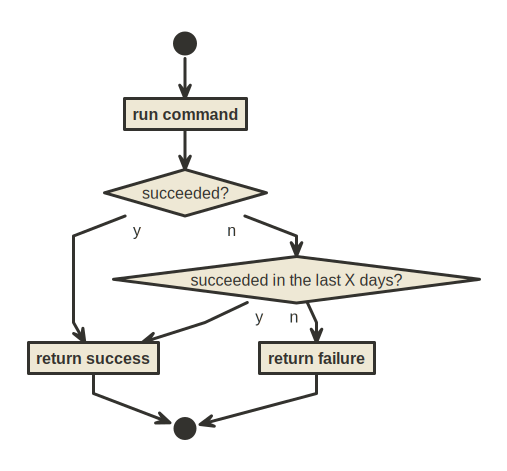

# ignore-flakes



A command envelope that tracks a repeated command's successes, and ignores
command failures if the command has succeeded recently.

It is useful for commands that are flaky and are required to succeed only
ocassionally.

## Development

This section is intended for developers. It describes development related matters.

### Dev environment setup

1. Install hlint and fourmolu, which are used in pre-commits:

   ```shell
   stack install hlint fourmolu
   ```

2. To install some development tools (commitlint), set up npm:

   ```shell
   npm install
   ```

3. To setup Git hooks, install lefthook:

   ```shell
   lefthook install
   ```

### Building

To build the binary, run

```
stack build
```
